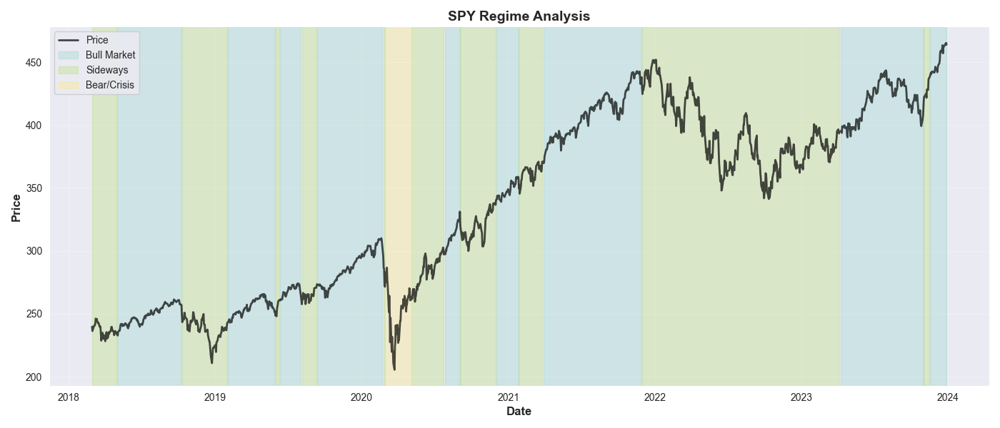

# Sticky Hidden Markov Model for Financial Regime Detection

## Overview
This project implements a **Sticky Hidden Markov Model (HMM)** from scratch to identify latent market regimes in financial time series. 
By analyzing the joint distribution of asset returns and rolling volatility, the system segments market history into statistically distinct states. This provides a rigorous mathematical framework for regime-dependent risk management and asset allocation.

---

## Key features 
* **From-Scratch Implementation:** Built the core HMM engine (Baum-Welch and Viterbi) using `NumPy` and `SciPy` to ensure full control over transition dynamics and emission modeling.
* Implemented all probability calculations in **log-space** using `logsumexp` to prevent floating-point underflow during the Forward-Backward pass on long historical datasets.
* Integrated a `sticky_param` ($\kappa$) to the transition matrix. This regularizes the model to favor self-transitions, successfully suppressing "regime chatter" and ensuring identified states are long enough to be actionable.
* **Robust Initialization:** Uses a K-Means++ inspired approach for emission means and multiple random restarts to avoid local optima in the non-convex likelihood surface.

---

## Empirical Results (SPY Analysis: 2018–2024)
The model was trained on ~1,500 data points of SPY (S&P 500) data. It converged to three distinct economic regimes:

Regime | Interpretation | Annual Return | Annual Volatility | Frequency |
| :--- | :--- | :--- | :--- | :--- |
| **State 0** | **Bull Market** | **+22.92%** | **10.29%** | 51.29% |
| **State 1** | **Sideways/Choppy** | +0.06% | 22.03% | 45.65% |
| **State 2** | **Crisis/Tail Risk** | **-21.23%** | **68.19%** | 3.06% |

### Strategic Insight:
The model reveals that **45.6% of market history** is spent in a "Volatility Trap" (State 1), where the investor assumes double the risk of a Bull market for effectively zero expected return. State 2 successfully isolated extreme tail-risk events (e.g., March 2020) characterized by 68%+ annualized volatility.

---

## Project Structure
The repository is organized as a modular pipeline:
- `data.py`: Automated ingestion from Yahoo Finance and feature engineering (Log-returns, Rolling Vol).
- `hmm.py`: Core mathematical engine and log-space EM training logic.
- `evaluation.py`: Statistical validation suite and visualization tools.

---

### Visualizing Market Regimes
To validate the model's unsupervised learning capabilities, the decoded state sequence is overlaid on historical price action. 

**Key Observations:**
- **State 0 (Bull):** Shows long-term persistence during the 2021 recovery, validating the 'sticky' transition matrix.
- **State 1 (Choppy):** Dominates the 2022 inflationary bear market, correctly identifying a regime of high volatility with negative price drift.
- **State 2 (Crisis):** Precisely captures the high-volatility regime during the 2020 market drawdown.

