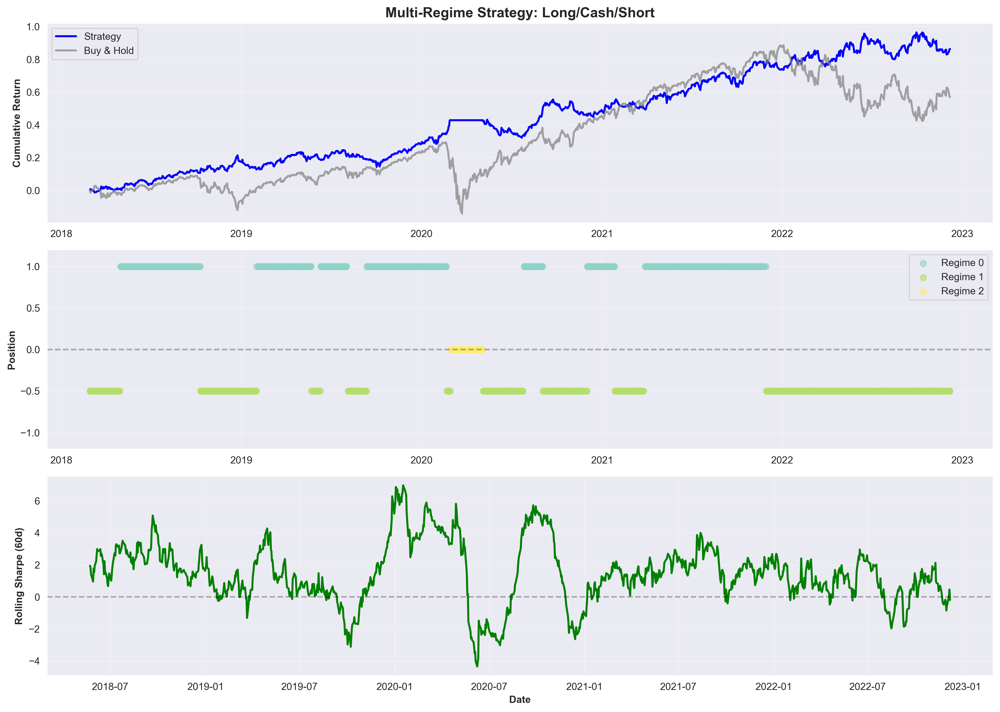
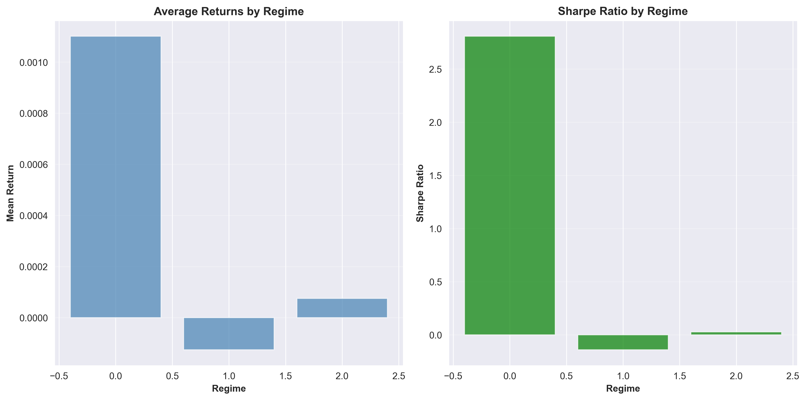

# Sticky Hidden Markov Model for Financial Regime Detection and Strategy Backtesting

## Overview
This project implements a **Sticky Hidden Markov Model (HMM)** from scratch to identify latent market regimes in financial time series. 
By analyzing the joint distribution of asset returns and rolling volatility, the system segments market history into statistically distinct states. This provides a rigorous mathematical framework for analyzing regime-dependent risk characteristics and evaluating asset allocation strategies. Strategies are evaluated using a historical backtesting framework with transaction costs and risk-adjusted performance metrics.

---

## Key Features 
* **From-Scratch Implementation:** Built the core HMM engine (Baum-Welch and Viterbi) using `NumPy` and `SciPy` to ensure full control over transition dynamics and emission modeling.
* Implemented all probability calculations in **log-space** using `logsumexp` to prevent floating-point underflow during the Forward-Backward pass on long historical datasets.
* Integrated a `sticky_param` ($\kappa$) to the transition matrix. This regularizes the model to favor self-transitions, successfully suppressing "regime chatter" and ensuring inferred regimes exhibit temporal persistence suitable for downstream strategy evaluation.
* **Robust Initialization:** Uses a K-Means++ inspired approach for emission means and multiple random restarts to avoid local optima in the non-convex likelihood surface.
* **Regime-Based Strategy Backtesting:** Maps inferred regimes to trading positions and evaluates performance against a buy-and-hold benchmark with transaction costs.
* **Risk-Adjusted Evaluation:** Computes Sharpe, Sortino, Calmar ratios, maximum drawdown, and tail risk metrics (VaR, CVaR).

---

## Strategy Backtest Results (SPY 2018–2024)
### Backtest Assumptions
- Asset: SPY (daily data)
- Strategy: Long exposure in the highest-return regime; cash otherwise
- Transaction cost: 10 bps per position change
- No leverage or shorting
- Metrics computed on daily returns

| Metric | Buy & Hold | HMM Regime Strategy (Long/Cash) |
| :--- | :--- | :--- |
| **Total Return** | 56.91% | **83.63%** |
| **Annualized Return** | 11.78% | **12.96%** |
| **Sharpe Ratio** | 0.545 | **1.883** |
| **Max Drawdown** | 33.72% | **6.80%** |
| **Calmar Ratio** | 0.349 | **1.906** |

**Performance Summary:**  
The regime-based strategy achieved materially lower drawdowns and improved risk-adjusted performance relative to buy-and-hold over the evaluation period.



---

## Market Regime Characteristics
The model was trained on ~1,500 data points of SPY (S&P 500) data. It converged to three distinct economic regimes based on the joint distribution of returns and volatility:

Regime | Interpretation | Mean Annualized Return | Annualized Volatility | Frequency |
| :--- | :--- | :--- | :--- | :--- |
| **State 0** | **Bull Market** | **+22.92%** | **10.29%** | 51.29% |
| **State 1** | **Sideways/Choppy** | +0.06% | 22.03% | 45.65% |
| **State 2** | **Crisis/Tail Risk** | **-21.23%** | **68.19%** | 3.06% |

---

## Visualizing Regime Performance



---

## Visualizing Market Regimes
To validate the model's unsupervised learning capabilities, the decoded state sequence is overlaid on historical price action. 


**Key Observations:**
- **State 0 (Bull):** Shows long-term persistence during the 2021 recovery, validating the 'sticky' transition matrix.
- **State 1 (Choppy):** Dominates the 2022 inflationary bear market, identifying a regime of elevated volatility and weak/negative price drift.
- **State 2 (Crisis):** Precisely captures the high-volatility regime during the 2020 market drawdown.

## Strategic Insight
The model reveals that **45.6% of market history** is spent in a "Volatility Trap" (State 1), where the investor assumes double the risk of a Bull market for effectively zero expected return. State 2 corresponds to periods of extreme tail-risk events (e.g., March 2020) characterized by 68%+ annualized volatility.

---

## Project Structure
The repository is organized as a modular pipeline:
- `data.py`: Automated ingestion from Yahoo Finance and feature engineering (Log-returns, Rolling Vol).
- `hmm.py`: Core mathematical engine and log-space EM training logic.
- `evaluation.py`: Statistical validation suite and visualization tools.

---

## Usage

**Installation**
Clone the repository and install the required dependencies:
```bash
git clone git@github.com:TimGunn60/Hidden-Markov-Model.git
cd Hidden-Markov-Model
pip install -r requirements.txt
```

To run a full regime-based backtest and generate evaluation plots:
```bash
python -m experiments.test_backtest
```

---

## Limitations and Future Work
- Model parameters are trained on a fixed historical window (no walk-forward retraining).
- Regime-to-position mappings are rule-based and not optimized.
- Future extensions include online retraining, multi-asset portfolios, and dynamic position sizing.